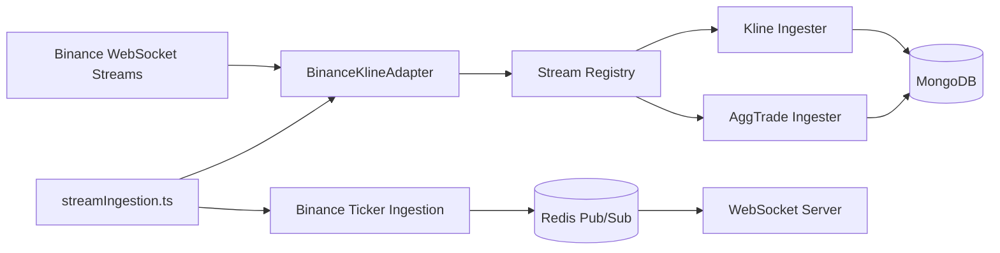
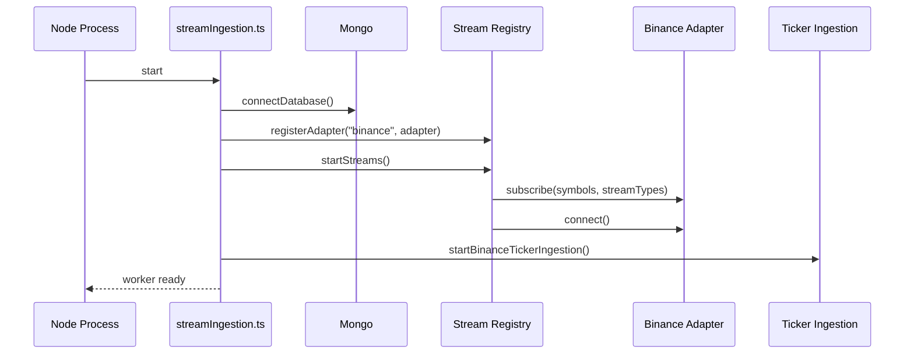

# streamIngestion.ts Datasheet

## Component Name

`streamIngestion.ts`

## Location

[`src/workers/streamIngestion.ts`](./streamIngestion.ts)

## Device Class

Realtime ingestion worker for market-stream acquisition, normalization, persistence, and Redis fanout support.

Think of it like a backend timing-and-data IC:

- it receives raw high-frequency market signals
- conditions them through adapters and ingestors
- writes durable series data
- publishes live price state for websocket delivery

If this worker is down, the backend does not lose all API capability, but it loses a major part of its live-market nervous system.

## One-Line Purpose

Connect to Binance streams, ingest `@ticker`, `kline`, and optional `aggTrade` events, persist chart data into Mongo, and keep Redis-fed realtime price delivery alive for the rest of the backend.

## Functional Role In The Backend

This worker is one of the critical operational subsystems behind:

- live market prices
- websocket price updates
- chart candle history growth
- aggregated trade capture
- market freshness for explore/chart surfaces

It is especially important because it bridges external exchange data into internal storage and internal realtime channels.

## External Interfaces

## Inputs

- MongoDB connection from [`src/config/database.ts`](../config/database.ts)
- Binance websocket streams through:
  - [`src/services/streams/adapters/binanceAdapter.ts`](../services/streams/adapters/binanceAdapter.ts)
  - [`src/services/binanceTickerIngestion.ts`](../services/binanceTickerIngestion.ts)
- runtime config from [`src/config/streamConfig.ts`](../config/streamConfig.ts)
- environment variables controlling symbols, aggTrade enablement, buffer sizes, and retention

## Outputs

- Mongo `OhlcvKline` writes through [`src/services/streams/ingestors/klineIngester.ts`](../services/streams/ingestors/klineIngester.ts)
- Mongo `MarketTrade` writes through [`src/services/streams/ingestors/aggTradeIngester.ts`](../services/streams/ingestors/aggTradeIngester.ts)
- Redis pub/sub price batches through [`src/services/binanceTickerIngestion.ts`](../services/binanceTickerIngestion.ts)
- stream observability counters in [`src/observability/streamMetrics.ts`](../observability/streamMetrics.ts)

## Primary Consumers Of Its Output

- websocket server: [`src/websocket/server.ts`](../websocket/server.ts)
- chart endpoints and snapshot builders reading Mongo chart collections
- any API surface relying on fresh price movement or historical stream-derived data

## Top-Level Block Diagram

## Internal Startup Sequence

## Pinout-Style Interface Table

| Pin | Type | Source / Sink | Description |
|---|---|---|---|
| `PWR_MONGO` | dependency | MongoDB | Required for kline and aggTrade persistence |
| `PWR_REDIS` | dependency | Redis | Required for live ticker publish path |
| `CLK_BINANCE_KLINE` | input | Binance | 1m kline stream input |
| `CLK_BINANCE_AGGTRADE` | input | Binance | optional aggTrade stream input |
| `CLK_BINANCE_TICKER` | input | Binance | live 24h ticker input |
| `CFG_STREAMS` | control | env/config | symbols, exchanges, aggTrade enablement, flush timing |
| `OUT_KLINES` | output | Mongo | durable OHLCV candle writes |
| `OUT_TRADES` | output | Mongo | durable aggregated trade writes |
| `OUT_PRICE_BATCHES` | output | Redis | batched live price updates for websocket consumers |
| `OBS_METRICS` | output | metrics | ingestion counters, drops, retry exhaustion, event loop lag |

## Internal Functional Parts

## 1. Worker Shell

Source:

- [`src/workers/streamIngestion.ts`](./streamIngestion.ts)

Responsibilities:

- connect Mongo
- register Binance stream adapter
- start stream registry
- start ticker ingestion
- own shutdown hook

This file is intentionally small. It is the orchestrator, not the whole implementation.

## 2. Stream Registry

Source:

- [`src/services/streams/registry.ts`](../services/streams/registry.ts)

Responsibilities:

- maintain registered adapters
- route normalized stream events by type
- start subscribed streams from config
- stop all adapters on shutdown

This is the worker’s internal switch fabric.

## 3. Binance Adapter

Source:

- [`src/services/streams/adapters/binanceAdapter.ts`](../services/streams/adapters/binanceAdapter.ts)

Responsibilities:

- connect to Binance combined websocket streams
- parse raw kline and aggTrade payloads
- normalize vendor payloads to internal event shape
- reconnect with exponential backoff

This is the protocol-conversion stage.

## 4. Kline Ingester

Source:

- [`src/services/streams/ingestors/klineIngester.ts`](../services/streams/ingestors/klineIngester.ts)

Responsibilities:

- buffer normalized kline events
- flush periodically or by batch size
- bulk upsert candle rows into Mongo
- cap memory buffer
- retry limited Mongo requeues

This is the durable candle-writer stage.

## 5. AggTrade Ingester

Source:

- [`src/services/streams/ingestors/aggTradeIngester.ts`](../services/streams/ingestors/aggTradeIngester.ts)

Responsibilities:

- buffer aggregated trades
- insert batches into Mongo
- cap memory buffer
- retry limited Mongo requeues

This is optional in production depending on config.

## 6. Binance Ticker Ingestion

Source:

- [`src/services/binanceTickerIngestion.ts`](../services/binanceTickerIngestion.ts)

Responsibilities:

- determine desired symbol set
- open/reopen Binance `@ticker` streams
- parse live price payloads
- coalesce updates briefly
- publish price batches to Redis

This is the low-latency live-price output stage.

## Operating Modes

## Normal Mode

- Mongo connected
- Redis connected
- Binance reachable
- kline ingestion active
- ticker ingestion active
- optional aggTrade active if enabled

## Reduced Mode

- Redis unavailable: ticker publish path degrades; candle/trade persistence may still continue if Mongo is healthy
- Mongo unavailable: stream events can be received, but durable ingestors will fail and eventually drop on retry exhaustion
- Binance unavailable: worker remains alive and reconnects, but no fresh market data enters the system

## Disabled / Minimal Mode

- `ENABLE_AGGTRADE=false` reduces CPU/bandwidth cost and ingests only kline plus ticker paths

## Critical Timing And Buffer Characteristics

## Kline Path

From [`src/services/streams/ingestors/klineIngester.ts`](../services/streams/ingestors/klineIngester.ts):

- flush interval: `1500 ms`
- batch size: `300`
- max in-memory buffer default: `50000`
- max Mongo requeue streak default: `3`

## AggTrade Path

From [`src/services/streams/ingestors/aggTradeIngester.ts`](../services/streams/ingestors/aggTradeIngester.ts):

- flush interval: `2000 ms`
- batch size: `200`
- max in-memory buffer default: `50000`
- max Mongo requeue streak default: `3`

## Ticker Publish Path

From [`src/services/binanceTickerIngestion.ts`](../services/binanceTickerIngestion.ts):

- max Binance streams per connection: `200`
- reconnect debounce: `450 ms`
- Redis symbol poll interval: `500 ms`
- Redis publish flush interval: `120 ms`
- max reconnect delay: `60000 ms`

## Configuration Surface

Main source:

- [`src/config/streamConfig.ts`](../config/streamConfig.ts)

Important controls:

- `STREAM_EXCHANGES`
- `KLINE_SYMBOLS`
- `TICKER_SYMBOLS`
- `AGGTRADE_SYMBOLS`
- `ENABLE_AGGTRADE`
- `AGGTRADE_MAX_SYMBOLS`
- `PRICE_WS_FLUSH_MS`
- `KLINE_DOWNSAMPLER_CRON`
- retention env vars for kline intervals
- buffer env vars:
  - `KLINE_INGEST_MAX_BUFFER`
  - `AGGTRADE_INGEST_MAX_BUFFER`
  - `KLINE_MONGO_MAX_REQUEUE`
  - `AGGTRADE_MONGO_MAX_REQUEUE`

## Tolerance And Fault Behavior

## What It Tolerates Well

- temporary Binance disconnects through reconnect logic
- short bursts of inbound events through in-memory buffering
- transient Mongo write failures through bounded requeue attempts
- changing live symbol demand through Redis-driven ticker symbol polling

## What It Tolerates Partially

- Redis read failure in ticker symref lookup: falls back to baseline symbols
- Redis publish failure: worker keeps running, but live downstream freshness suffers
- one adapter/socket failure: reconnect logic attempts recovery without process restart

## What It Does Not Tolerate Well

- extended Mongo outage, because ingestion buffers are in-process and eventually drop data
- process restarts during high buffer occupancy, because buffered unsaved events are lost
- multi-instance ambiguity without topology discipline, because duplicated stream workers can duplicate upstream consumption and writes
- malformed or incompatible vendor payload shifts, because parser assumptions are code-level and exchange-specific

## Absolute Limitations

- current exchange support in this worker is effectively Binance-first
- only configured symbols are consumed
- kline storage is limited to recorded interval filtering in the ingester
- aggTrade coverage is intentionally capped to reduce CPU/bandwidth
- durability before Mongo write is not guaranteed; buffers are memory-resident

## Safety Margins And Design Guardrails

- capped buffers prevent unbounded memory growth
- capped requeue streak prevents infinite retry loops
- socket reconnect backoff avoids tight reconnect storms
- ticker publish coalescing protects Redis and websocket fanout consumers
- stream metrics expose drops and retry exhaustion

## Observability Hooks

Source:

- [`src/observability/streamMetrics.ts`](../observability/streamMetrics.ts)

Key metrics:

- inbound bytes/messages
- outbound bytes/messages
- Redis publish total
- connected websocket clients
- kline buffer high-water mark
- aggTrade buffer high-water mark
- kline dropped events
- aggTrade dropped events
- Mongo retry exhaustion counts
- event loop lag mean and max

These are the main “health pins” for this component.

## Failure Modes And User Impact

| Failure mode | Immediate effect | User-visible impact |
|---|---|---|
| worker not running | no fresh stream ingestion | stale live prices, stale chart growth |
| Mongo unavailable | kline/trade persistence fails | charts degrade or stop updating over time |
| Redis publish failing | live ticker fanout breaks | websocket clients stop receiving fresh price batches |
| Binance disconnected | no fresh external stream data | all realtime freshness decays |
| buffer overflow | oldest buffered events dropped | partial market-history gaps and reduced fidelity |
| duplicated workers | duplicate upstream consumption possible | noisy data, redundant writes, harder ops diagnosis |

## Why This Worker Is Crucial

This worker is crucial because it is not just one more background job. It is the bridge between:

- external exchange reality
- internal durable time-series storage
- internal realtime delivery infrastructure

Without it:

- websocket price updates become stale or stop
- candle history stops growing correctly
- aggTrade-derived analytics lose freshness
- market-facing UI quality degrades quickly
- downstream components relying on Redis price batches lose their live signal

## Practical Mental Model

If the backend were a living system:

- Mongo is long-term memory
- Redis is the short-term signaling network
- websocket delivery is the motor output
- `streamIngestion.ts` is one of the primary sensory input processors

It continuously samples the market, normalizes the signal, writes durable traces, and emits live changes.

## If You Need To Change It Safely

1. Check `streamConfig` first.
2. Check whether the change affects ticker, kline, aggTrade, or all three paths.
3. Confirm whether downstream Redis consumers or Mongo models expect the current shape.
4. Watch buffer high-water marks and retry exhaustion counters.
5. Be careful not to introduce duplicate ingestion topology with the inline API ticker path.

## Summary Verdict

`streamIngestion.ts` is a high-importance infrastructure worker.

It is not the entire market system by itself, but it is one of the core runtime components that keeps the backend’s market data:

- fresh
- durable
- streamable
- operationally useful

Any major issue in this worker will have outsized impact on realtime behavior across the backend.
